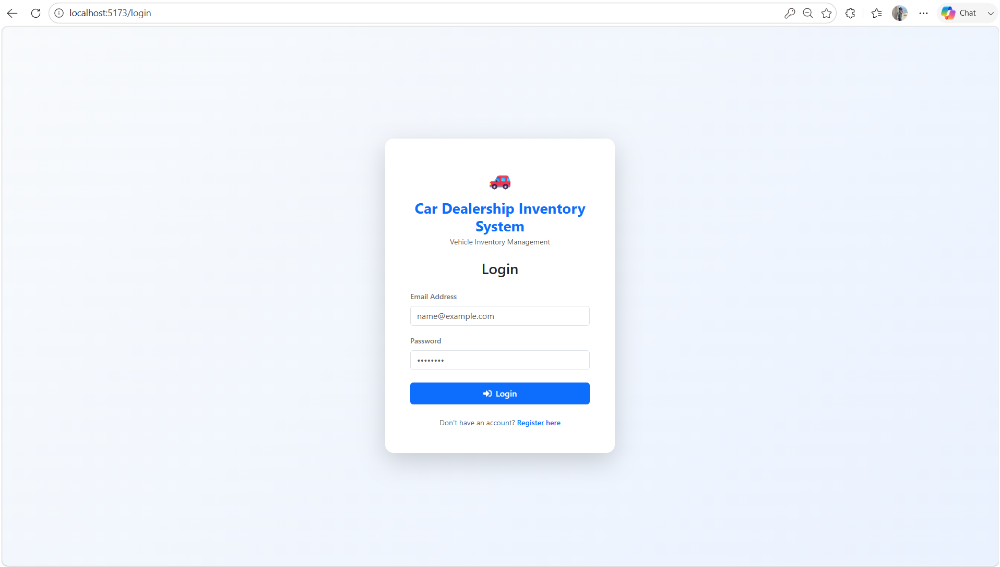
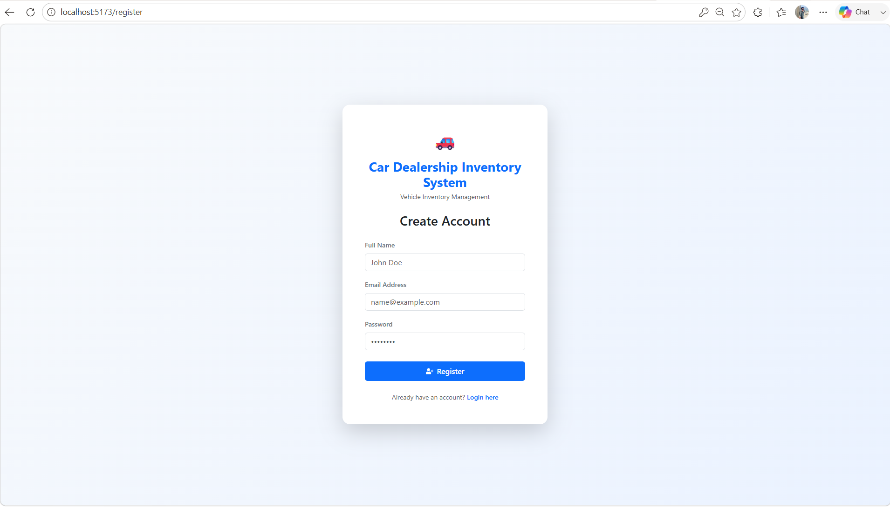
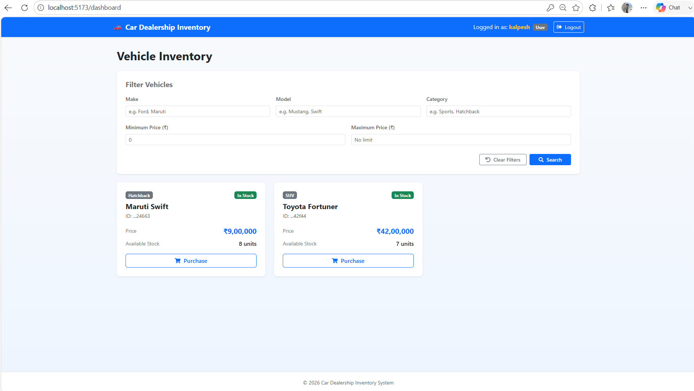
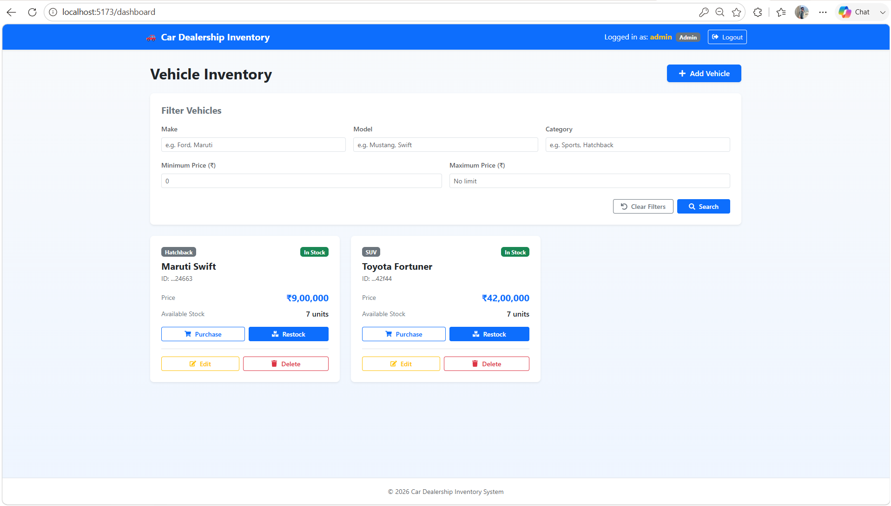
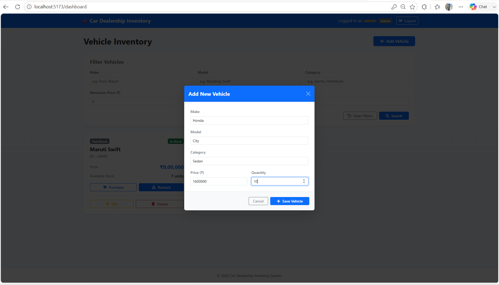
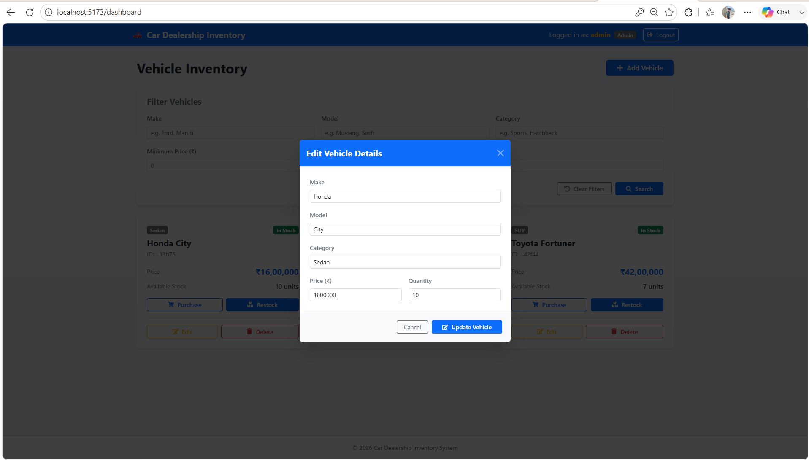
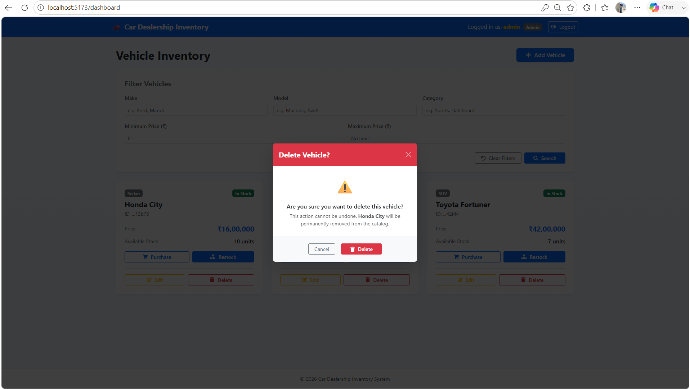
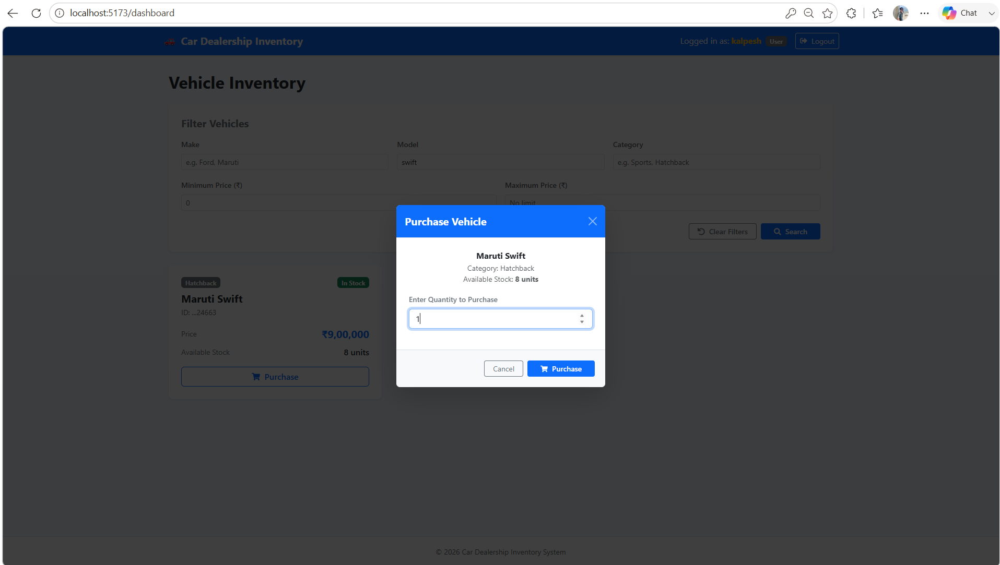
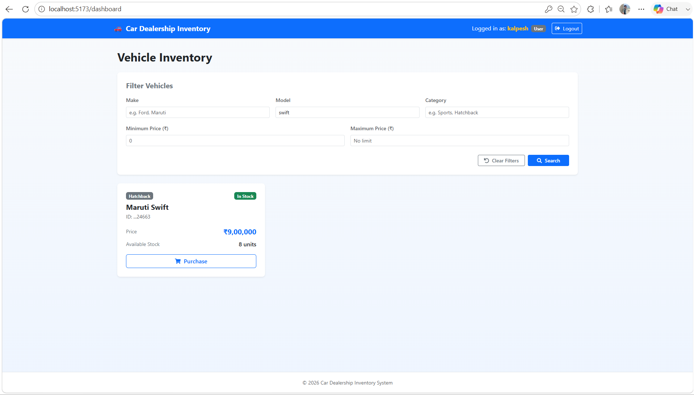
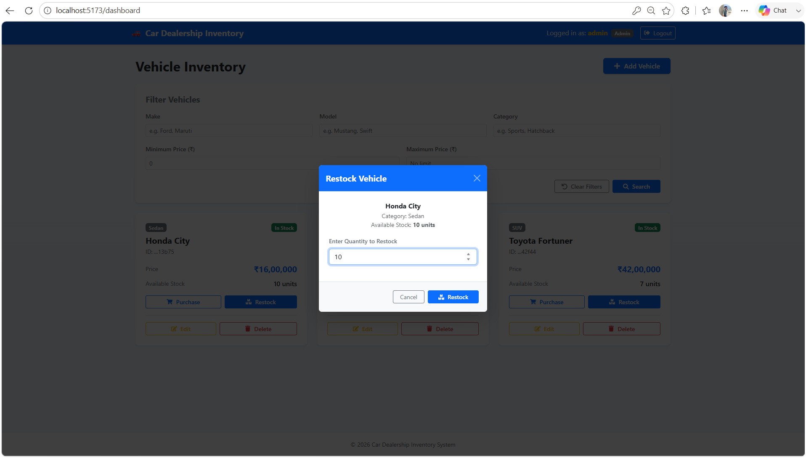

# Car Dealership Inventory System

> Full-stack Vehicle Inventory Management System built with React, Node.js, Express, MongoDB, and JWT Authentication.

## Project Overview
The Car Dealership Inventory System is a full-stack web application developed as part of the Incubyte Software Craftsperson Internship assessment.

It enables authenticated users to browse and purchase vehicles, while administrators can manage the inventory by adding, updating, deleting, and restocking vehicles. The project follows RESTful API principles, role-based authentication using JWT, and a responsive React frontend.

## Repository
GitHub Repository: [https://github.com/kalpeshgangani16/car-dealership-inventory-system](https://github.com/kalpeshgangani16/car-dealership-inventory-system)

---

## Features

| Feature | Status |
| :--- | :---: |
| User Registration | ✅ |
| User Login | ✅ |
| JWT Authentication | ✅ |
| Role-Based Authorization | ✅ |
| Vehicle Listing | ✅ |
| Search & Filter | ✅ |
| Add Vehicle | ✅ |
| Edit Vehicle | ✅ |
| Delete Vehicle | ✅ |
| Purchase Vehicle | ✅ |
| Restock Vehicle | ✅ |
| Responsive UI | ✅ |

---

## Technology Stack

| Layer | Technology |
| :--- | :--- |
| Frontend | React, Vite |
| Routing | React Router DOM |
| Styling | Bootstrap 5 |
| Icons | React Icons |
| HTTP Client | Axios |
| Backend | Node.js, Express.js |
| Database | MongoDB Atlas |
| ODM | Mongoose |
| Authentication | JWT |
| Password Hashing | bcrypt |
| Testing | Jest, Supertest |

---

## Project Folder Structure

```
car-dealership-inventory-system/
├── backend/
│   ├── src/
│   │   ├── config/         # Database connection configuration
│   │   ├── controllers/    # API request handlers (Auth, Vehicles)
│   │   ├── middleware/     # Auth, Roles, and input validation middlewares
│   │   ├── models/         # Mongoose models (User, Vehicle)
│   │   ├── routes/         # Express router endpoints
│   │   └── app.js          # Express app initialization
│   └── tests/              # Jest integration tests
├── frontend/
│   ├── src/
│   │   ├── api/            # Axios API configuration
│   │   ├── components/     # Modals and Cards (VehicleCard, QuantityModal, etc.)
│   │   ├── context/        # AuthContext for session management
│   │   ├── layouts/        # Layout wrappers (AuthLayout, DashboardLayout)
│   │   ├── pages/          # Pages (LoginPage, RegisterPage, DashboardPage, NotFoundPage)
│   │   ├── services/       # API call handlers mapping (vehicleService, authService)
│   │   └── main.jsx        # App mounting and entry point
│   ├── index.html          # Index HTML shell
│   └── vite.config.js      # Vite build configuration
└── README.md               # Documentation
```

---


## API Endpoints

### Authentication
- `POST /api/auth/register` - Register a new user.
- `POST /api/auth/login` - Authenticate credentials and return JWT token.

### Vehicle Catalog
- `GET /api/vehicles` - Retrieve all vehicles.
- `GET /api/vehicles/search` - Query vehicles using filter fields (`make`, `model`, `category`, `minPrice`, `maxPrice`).
- `POST /api/vehicles` - Add a new vehicle (Admin only).
- `PUT /api/vehicles/:id` - Update vehicle details (Admin only).
- `DELETE /api/vehicles/:id` - Delete a vehicle (Admin only).
- `PATCH /api/vehicles/:id/purchase` - Purchase/deduct vehicle stock count.
- `PATCH /api/vehicles/:id/restock` - Restock/increase vehicle stock count (Admin only).

---

## Local Installation & Setup

### Prerequisites
- Node.js installed locally.
- MongoDB instance (local or MongoDB Atlas connection link).

### Backend Setup
1. Navigate to the backend directory:
   ```bash
   cd backend
   ```
2. Install dependencies:
   ```bash
   npm install
   ```
3. Copy the example environment file:
   ```bash
   cp .env.example .env
   ```
   *For Windows users: Copy `backend/.env.example` to `backend/.env`.*

   Then update the values in `.env`:
   ```env
   PORT=5000
   MONGO_URI=your_mongodb_connection_string
   JWT_SECRET=your_jwt_secret
   ```
4. Run the backend development server:
   ```bash
   npm run dev
   ```

### MongoDB Setup
This project uses MongoDB as its database.

You can either:
- Create a free MongoDB Atlas cluster and use its connection string.
- Or use a local MongoDB instance.

Update the `MONGO_URI` value in `backend/.env` before running the backend.

### Frontend Setup
1. Navigate to the frontend directory:
   ```bash
   cd ../frontend
   ```
2. Install dependencies:
   ```bash
   npm install
   ```
3. Run the Vite development compiler:
   ```bash
   npm run dev
   ```
4. Open your browser to `http://localhost:5173`.

---

## Demo Accounts

### Admin
- **Email**: admin@gmail.com
- **Password**: admin@123

---

### Login Page



---

### Registration Page



---

### User Dashboard



---

### Admin Dashboard



---

### Add Vehicle



---

### Edit Vehicle



---

### Delete Vehicle



---

### Purchase Vehicle



---

### Filter Vehicle



---

### Restock Vehicle (Admin)



---

## Test Report

Backend integration tests were written using Jest and Supertest.

The test suite covers:
- Authentication
- Vehicle CRUD
- Purchase API
- Restock API
- Authorization
- Validation

### Execution Summary
- **Test Suites**: 10 passed, 10 total
- **Tests**: 70 passed, 70 total
- **Status**: ✅ All tests passing

---

## My AI Usage

### AI Tools Used
- ChatGPT
- Antigravity

### How I Used AI
I used AI throughout the development process to improve productivity while ensuring I understood and verified every implementation.

Examples include:
- Generating initial project structure and boilerplate code.
- Designing REST API structure.
- Writing and improving Jest integration tests.
- Debugging authentication and MongoDB issues.
- Suggesting React component structures.
- Improving UI design and responsiveness.
- Assisting with README documentation.

### Reflection
AI significantly reduced development time by automating repetitive tasks and providing implementation suggestions. However, every generated solution was reviewed, modified when necessary, tested manually, and integrated only after understanding the underlying logic.

---

## Future Improvements
- **Transactions Audit Logging**: Log every purchase and restock transaction in a dedicated database collection.
- **Order / Purchase History**: Display a historical listing of completed purchases for customers.
- **Email Notifications**: Trigger email notifications to users and admins upon successful order processing.
- **Pagination Support**: Paginate the `/api/vehicles` catalog queries to support scaling inventory.
- **Vehicle Image Uploads**: Add vehicle image uploads using Cloudinary or AWS S3.

---

## Author

**Kalpesh Gangani**  
B.Tech Computer Engineering  
Dharmsinh Desai University  